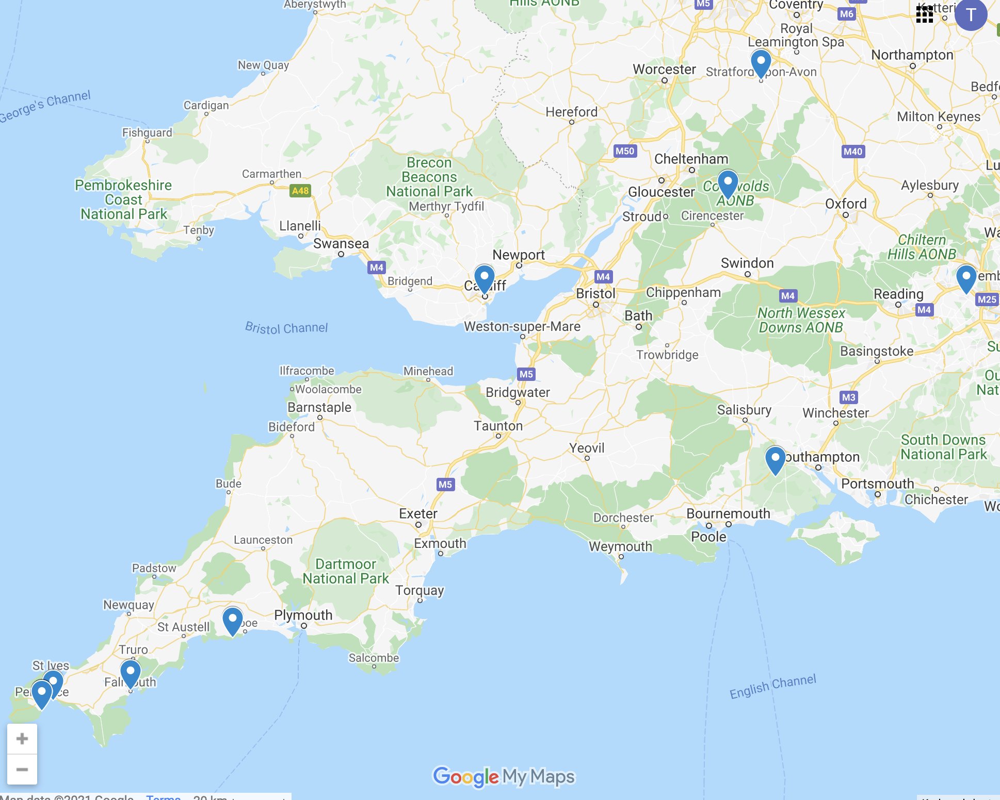
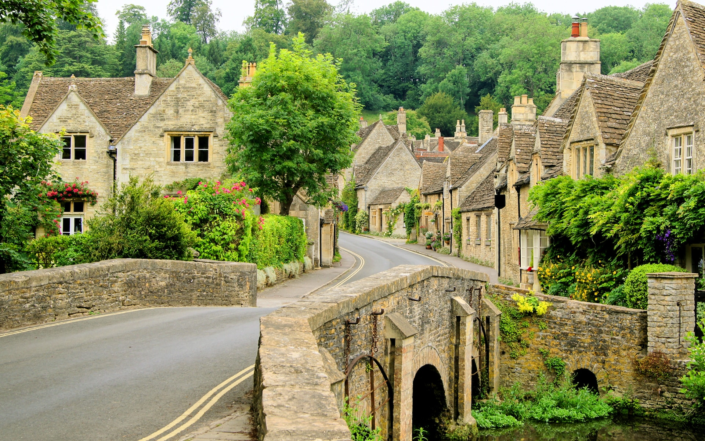
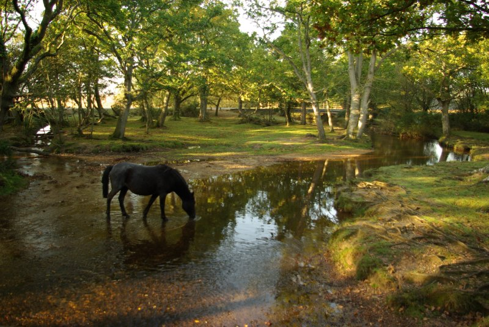
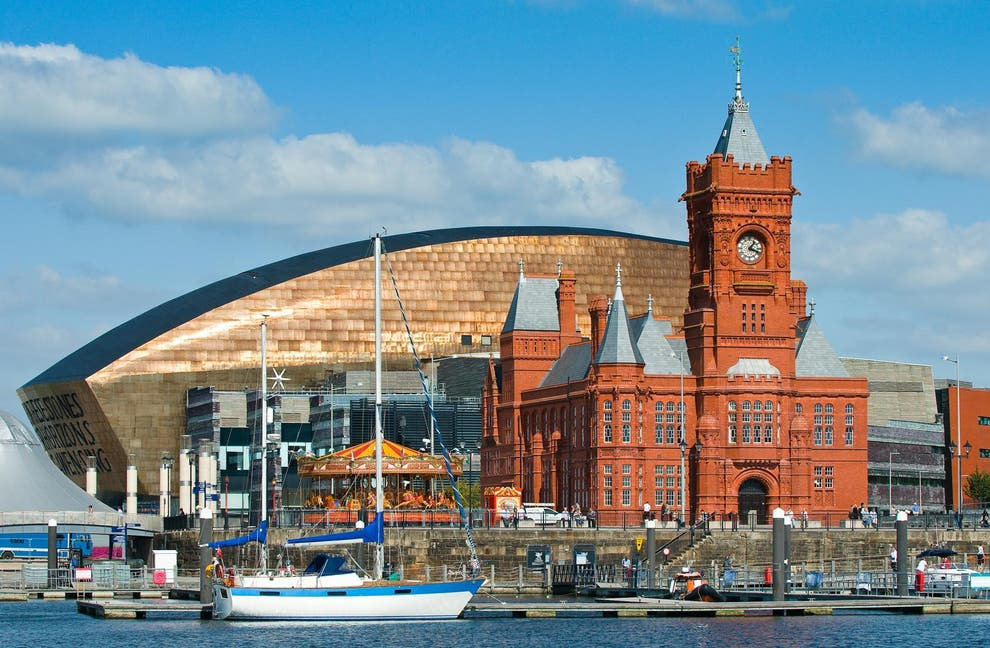
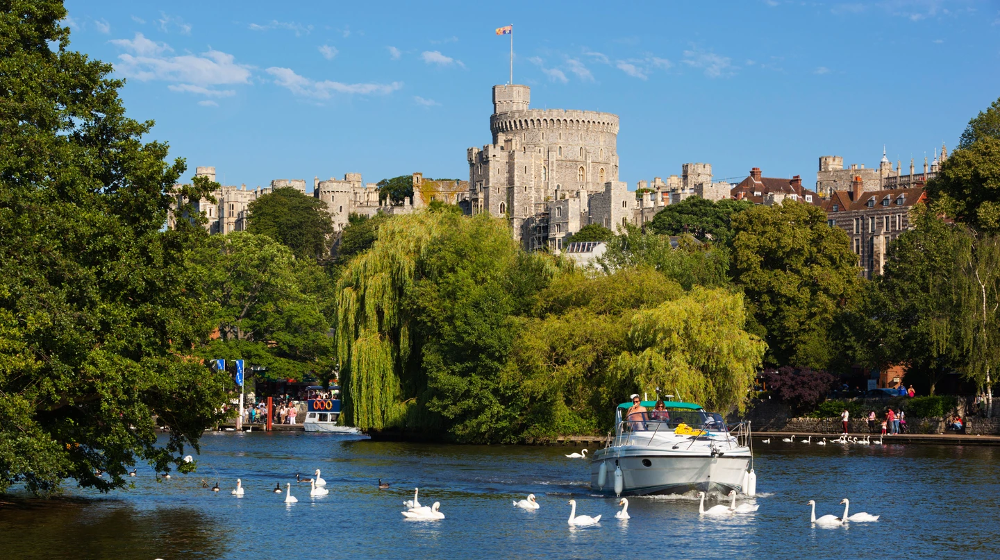
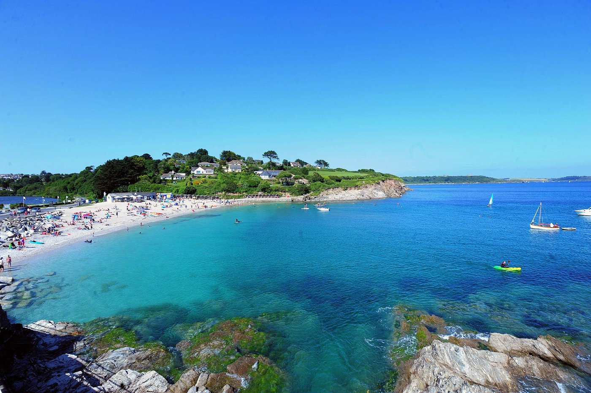
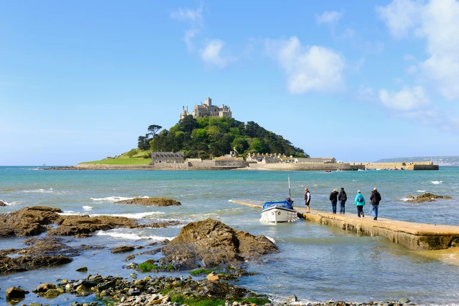
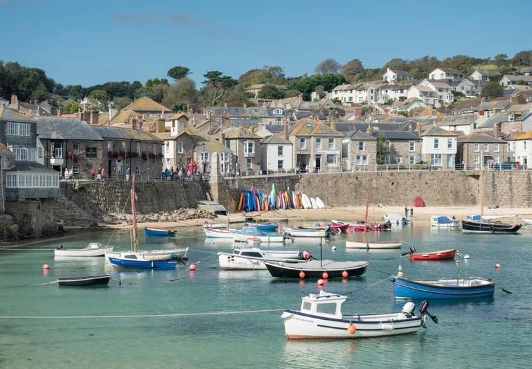
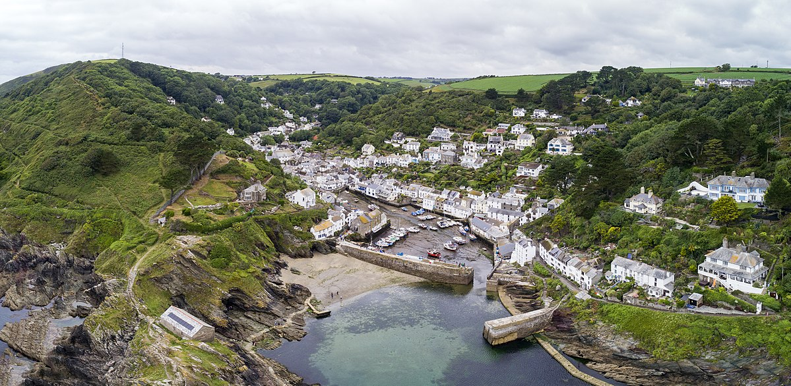

# UK Trip Ideas

## Places to visit

https://www.google.com/maps/d/edit?mid=1ptLmHZDeqWauessnuSp8KTJ-MM4GawZH&usp=sharing

https://goo.gl/maps/SzUCoTJaxpZenEBh7

### Costwolds

https://www.roughguides.com/articles/prettiest-cotswolds-villages-to-visit/

### New forest

https://www.thenewforest.co.uk/ideas-and-inspiration/blog/read/2019/03/simply-the-best-places-to-eat-in-the-magical-new-forest-b114

### Cardiff

https://www.independent.co.uk/travel/uk/cardiff-what-do-staycation-castle-watertaxi-st-davids-arcade-dr-who-experience-a7815281.html

### Windsor

https://theculturetrip.com/europe/united-kingdom/england/articles/10-best-things-to-see-and-do-in-windsor-england/

### Cornwall
https://theculturetrip.com/europe/united-kingdom/articles/the-best-things-to-see-and-do-in-cornwall/
#### Falmouth, Cornwall

#### St Michael’s Mount, Cornwall

#### Mousehole Harbour, Cornwall

#### Polperro, Cornwall

